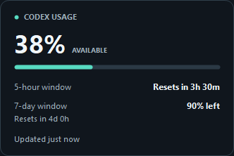
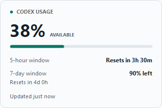

# Codex Usage Notch

A small Windows app that keeps your remaining Codex allowance visible while you work. It sits in the notification area beside the clock and can show a thin strip at the top of your screen. Hover either indicator to see your remaining percentage and when each usage window resets.

The app shows the Codex subscription allowance reported for your ChatGPT account. It does not show API spending, token totals, or a per-conversation usage breakdown.

**Jump to:** [Get started](#get-started) · [Controls](#controls) · [Reading the card](#reading-the-usage-card) · [How usage is collected](#how-the-app-gets-usage-from-codex) · [Troubleshooting](#troubleshooting) · [Development](#develop-and-test)

Example cards in dark and light mode (sample values):




## Get started

You need Windows x64 with a desktop session, an installed Windows `codex.exe`, and a ChatGPT sign-in that provides Codex allowance. Codex must be able to connect to its service to retrieve fresh usage.

### 1. Download an edition

Download the executable from [GitHub Releases](https://github.com/pHorvat/AI-Usage-Overview/releases). Open the release you want and expand **Assets**, then choose one of the `.exe` files below. You do not need to clone the repository or build the app yourself. The **Source code** archives are for working with the source; choose an `.exe` to run the app.

| Executable | Requirements |
| --- | --- |
| `CodexUsageNotch.exe` | Includes .NET; choose this if you are unsure which edition to use |
| `CodexUsageNotch-lite.exe` | Smaller edition for PCs that already have the .NET 8 Windows Desktop Runtime |

Both editions have the same features. Keep your chosen executable in a folder where you want it to stay, especially if you plan to enable startup with Windows.

**If you cloned this repository:** the executables are not tracked by Git. Install the .NET 8 SDK or newer, open PowerShell in the project folder, and build them:

```powershell
.\build\build-release.bat
```

This creates both executables in the project folder. See [Build a release](#build-a-release) for rebuilding an existing installation.

### 2. Launch and connect

1. Double-click your chosen executable. Look for the tray icon beside the Windows clock; it may be inside the hidden-icons menu.
2. The app locates Codex and tries to read usage using Codex's existing login. You do not need to keep a Codex terminal or VS Code window open.
3. If sign-in is needed, use **Connect ChatGPT** and finish signing in in your browser. Closing the app's sign-in window cancels the attempt; an unfinished attempt expires after five minutes.
4. Hover or click the tray icon to see the usage card. Right-click it and choose **Refresh now** whenever you want a fresh reading.

Run one edition at a time. If an instance is already running, opening another exits quietly.

### Updating the app

Download your preferred edition from [GitHub Releases](https://github.com/pHorvat/AI-Usage-Overview/releases), choose **Exit** from the running app's tray menu, and replace your old executable with the downloaded file. Launch it again to use the new version. Keep the same location and filename if you have enabled **Start with Windows**. Your saved preferences remain in place.

## Controls

| Action | Result |
| --- | --- |
| Hover the tray icon | Show a preview after a short delay; moving away cancels it |
| Click the tray icon or press Enter/Space on it | Immediately open the interactive card |
| Hover the top strip briefly | Show the usage preview |
| Move into the preview | Keep it open for reading |
| Move away from the preview and its indicator | Close the preview after a short grace period |
| Press Escape or click elsewhere | Close the interactive card |
| Right-click the tray icon | Refresh, connect, toggle the strip or usage ring, configure startup, or exit |

Use **Show top indicator** to toggle the strip and **Tray usage ring** to add a progress ring around the tray icon. Both preferences are remembered. Enable **Start with Windows** if you want the app to launch when you sign in; it is off by default.

The app follows Windows light/dark mode, high contrast, display scaling, and text size. The strip stays at the top of the primary monitor's working area.

## Reading the usage card

**The percentage is how much allowance you have left.** For example, if Codex reports 31% used, the app displays **69% remaining**.

The main percentage, top strip, and tray ring use Codex's **primary** allowance window. The card also shows the **secondary** window when supplied. Window labels come from the durations Codex reports: for example, 300 minutes becomes a 5-hour window and 10,080 minutes becomes a 7-day window. These durations are not hard-coded assumptions about your plan.

| Color or label | Meaning |
| --- | --- |
| Mint/green | More than 25% remaining |
| Amber | 11–25% remaining |
| Red | 10% or less remaining |
| **LAST KNOWN** | A previous reading is still displayed because the connection is not ready or the reading is at least two minutes old |
| **Awaiting reset update** | The reported reset time has passed; the app is waiting for Codex to confirm the new allowance |
| **Reset time unavailable** / **Not available** | Codex did not supply that value |

High-contrast mode uses Windows' highlight color. A countdown reaching zero does not change the percentage by itself.

## How the app gets usage from Codex

The indicator asks your installed Codex for account rate limits through its app-server interface. Codex handles authentication and communication with its service; the indicator turns the returned values into the card and progress indicators.

```text
Codex Usage Notch  <-->  Local Codex app-server  <-->  Codex service
                  JSON over stdin/stdout       Codex handles sign-in
```

### 1. Find the Codex executable

The app checks these locations in order and uses the first matching executable:

1. `codex.exe` beside the indicator executable.
2. `%UserProfile%\.codex\bin\codex.exe`.
3. `%LocalAppData%\Programs\Codex\codex.exe`, then its `resources\codex.exe` location.
4. Folders listed in `PATH`.
5. The OpenAI ChatGPT extension under `%UserProfile%\.vscode\extensions`, then `.vscode-insiders\extensions`. Within each location, newer extension versions are checked first for `bin\windows-x86_64\codex.exe`.

If none is found, it makes a final attempt to start `codex.exe` by name. The locator looks for a native Windows executable; an npm `codex.cmd` launcher alone is insufficient.

### 2. Start a background connection

The app starts its own hidden subprocess with this command:

```text
codex app-server --listen stdio://
```

It keeps one connection open for repeated reads, rather than launching Codex for every refresh. Messages are newline-delimited JSON sent through the process's standard input and output; this connection does not open a local HTTP port. The app sends `initialize` with its name and version, waits for the response, and then sends `initialized`.

The subprocess is owned by the indicator and stopped when the indicator exits. A failed connection is recreated when the app retries.

### 3. Request and interpret the allowance

After initialization, the app sends a request like this (the request ID changes):

```json
{"id": 2, "method": "account/rateLimits/read"}
```

The parser prefers the `codex` entry in `rateLimitsByLimitId` when present, otherwise it reads `rateLimits`. It rejects entries explicitly identified as a different limit. For the selected entry, it reads:

| Response field | How this app uses it |
| --- | --- |
| `primary.usedPercent` / `secondary.usedPercent` | Calculates remaining allowance as `100 - usedPercent` |
| `windowDurationMins` in each window | Formats the window label in minutes, hours, or days |
| `resetsAt` in each window | Converts Unix seconds to a timestamp and calculates the reset countdown |
| `planType` | Retains the plan value in memory when supplied; the current card does not display it |

Missing values stay unavailable instead of being guessed. Percentages must be whole numbers from 0 to 100; invalid readings are rejected. The indicator does not scan conversations, read session logs, count tokens, or send model prompts to obtain these values.

The methods and fields are documented in the [official OpenAI app-server documentation](https://learn.chatgpt.com/docs/app-server). This app's implementation is in [CodexUsageClient.cs](Integration/CodexUsageClient.cs), with response parsing and percentage calculations in [UsageState.cs](Core/UsageState.cs).

### 4. Keep the display current

- **On launch:** request the first reading immediately.
- **During normal use:** request another reading one minute after a successful refresh and accept `account/rateLimits/updated` notifications from the connected subprocess between reads.
- **On demand or after sleep:** refresh when you select **Refresh now**, or when Windows resumes.
- **On failure:** requests time out after 15 seconds. Connection failures retry after 5, 15, 30, then 60 seconds, continuing at 60-second intervals until a read succeeds. A required sign-in needs user interaction.

Notifications can contain partial updates, so omitted fields retain their previous values; a full read replaces the snapshot. When Codex reports an account change, the app clears the old account's reading and requests a fresh one.

Countdowns repaint locally about every 30 seconds without sending usage requests. Display freshness depends on the data Codex returns; the app cannot confirm a reset until it receives an updated reading.

### 5. Let Codex handle sign-in

The app uses the login available to the Codex subprocess. **Connect ChatGPT** starts a fresh subprocess and sends `account/login/start` with `type: "chatgpt"`. Codex returns an HTTPS sign-in URL, which the app opens in your browser. The app waits for `account/login/completed` and requests usage again after a successful sign-in.

The indicator does not read or store Codex's authentication tokens itself. You do not paste an API key into the indicator.

## Privacy and local files

The indicator keeps its current usage reading in memory and does not save credentials, account identity, or usage history. Codex manages its own authentication storage and network requests separately.

The indicator's files live in `%LocalAppData%\CodexUsageNotch`. Paste that path into File Explorer to open it:

| File | Contents |
| --- | --- |
| `settings.json` | Top-strip visibility and tray-ring preference |
| `diagnostics.log`, `diagnostics.log.1` | Sanitized operation names, timestamps, exception types, and error codes; roughly 128 KiB per file |

Diagnostics exclude raw responses, sign-in URLs, and credentials. The indicator uploads no logs. **Start with Windows** is stored separately in your Windows user's startup registry entry.

## Develop and test

Requires the .NET 8 SDK or newer. The project targets `net8.0-windows` and has no third-party packages. Initial restore may download Microsoft build/runtime packs. Run commands from the project root:

```powershell
# Build and run locally. Exit any existing instance first to see the new build.
dotnet run --project CodexUsageNotch.csproj -c Release

# Core tests only: no desktop interaction or Codex login needed.
.\build\test.bat -CoreOnly

# Desktop checks: briefly move and then restore the pointer.
.\build\test.bat

# Optional read-only check of your installed, signed-in Codex connection.
dotnet run --project tests\CodexUsageNotch.Tests.csproj -c Release -- --live
```

Tests use a console runner, so use `dotnet run`, not `dotnet test`. Failed checks return a nonzero exit code. Core tests cover parsing and connection behavior; desktop checks cover tray, popup, hover, and sign-in interactions. Builds never run tests. The test script compiles and runs the tests without publishing or replacing releases. Add `-Smoke` to also check both existing root release executables; it does not rebuild them. Successful smoke reports are removed; failed reports remain for diagnosis.

For UI layout work, generate 324 sample images and bounds/overlap checks across three palettes, three DPI scales, three text sizes, and twelve states:

```powershell
dotnet run --project CodexUsageNotch.csproj -c Release -- --render-previews .\build\previews
```

## Build a release

Exit the indicator, then run:

```powershell
.\build\build-release.bat
```

This publishes both editions, verifies their hashes, and replaces the root executables. **No tests run during a build**, including desktop or smoke tests. Successful promotion automatically deletes staging and its temporary build manifest. Failed builds retain output for diagnosis. No `.previous` backups or duplicate `dist/` releases are created.

To build while the indicator is running, use `build-release.bat -StageOnly`, exit the app when staging finishes, then use `build-release.bat -PromoteOnly`. Start your preferred root executable after promotion. A normal `dotnet build` does not update these release executables.

## Clean generated files

```powershell
.\build\clean.bat -WhatIf # Show what would be removed.
.\build\clean.bat         # Remove generated files.
```

Cleanup removes `bin/`, `obj/`, their test equivalents, staging files, preview images, smoke reports, old protocol-review output, test results, the obsolete `dist/` folder, and root `.previous`/`.new` leftovers. It preserves source, Git history, root release executables, and application settings. **Pending staged releases are removed too**; finish promotion first if you need them. `-StagingOnly` removes just staging.

The scripts in `build/` handle building (`build-release.bat`), testing (`test.bat`), and cleanup (`clean.bat`), each backed by a PowerShell script. The `.bat` launchers avoid unsigned-script restrictions for their child process without changing the machine execution policy. Build caches remain after a release to speed up subsequent builds; run cleanup when you want a tidy workspace.

## Source layout

| Path | Responsibility |
| --- | --- |
| `Program.cs` | Startup, single-instance guard, preview and smoke modes |
| `NotchApplicationContext.cs` | Coordinates refreshes, sign-in, tray actions, and shutdown |
| `Core/` | Usage parsing/state, preferences, startup registration, diagnostics |
| `Integration/` | Codex discovery and app-server transport; Windows tray integration |
| `UI/` | Cards, windows, themes, icons, and preview rendering |
| `Assets/` | App icons and sample screenshots |
| `tests/` | Core and desktop test runners |
| `build/` | Build, test, and cleanup scripts |

## Troubleshooting

- **Codex not found:** install Codex or expose its underlying Windows `codex.exe` on PATH, then Refresh. An npm `.cmd` launcher alone is insufficient.
- **Last known usage:** check Codex's connection and select Refresh. The previous reading remains visible during retries.
- **Sign-in failed:** select Connect ChatGPT again to request a fresh link.
- **Tray icon hidden:** check Windows' notification overflow area.
- **Changes not visible:** exit the existing instance and run the new build; root releases need the release script.
- **Cleanup reports a running app or locked files:** exit the development/test executable and retry.

The app-server interface can change with Codex updates. Mixed-DPI monitors, Narrator, overflow-tray behavior, Explorer restart, sleep/resume, and browser/network failures still need manual checks on target hardware. Releases are distributed as standalone executables through GitHub Releases. There is no installer, code signing, or automatic updater.

To uninstall, disable **Start with Windows**, exit, and delete the executable. Delete the local settings/log folder separately if desired.
